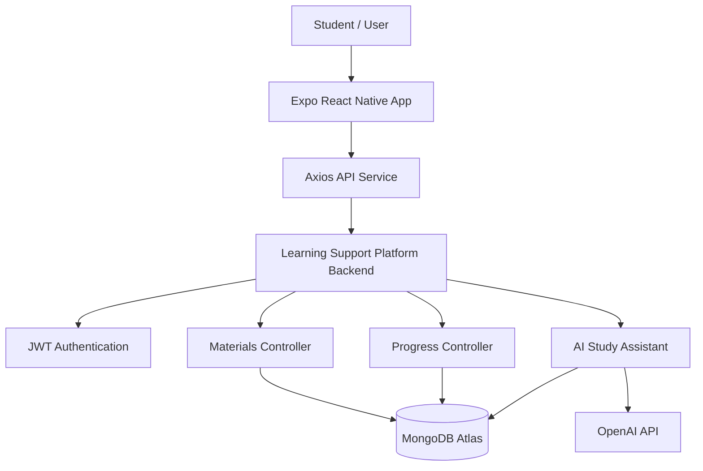
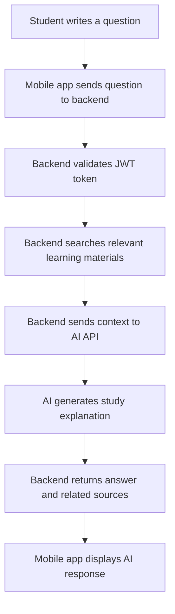

# My Learning App

**My Learning App** is a mobile learning application built with **Expo React Native**. This app is the mobile client version of the Learning Support Platform, designed to help students access structured learning materials, track learning progress, and ask questions through an AI Study Assistant.

The mobile app connects to the deployed backend API from the Learning Support Platform project. The backend handles authentication, learning materials, progress tracking, MongoDB data storage, and AI response generation.

---

## Live Backend API

Backend API used by this mobile app:

```txt
https://learning-support-platform-six.vercel.app/api
```

Backend health check:

```txt
https://learning-support-platform-six.vercel.app/api/health
```

---

## Project Overview

My Learning App allows students to register, login, browse learning materials, filter materials by subject, search materials by keyword, open material details, mark materials as completed, reset progress, and use an AI Study Assistant to ask questions about learning content.

This project was created as a mobile portfolio project to practice cross-platform app development, API integration, authentication flow, persistent login sessions, mobile UI design, and backend communication using REST API.

---

## Problem Statement

Students often need a simple and accessible way to study from their phone. Learning materials can be scattered, difficult to organize, and hard to track. Without a clear dashboard, students may forget which materials they have completed or what they should study next.

My Learning App solves this problem by providing a mobile learning dashboard where students can access materials, monitor progress, and get AI-powered explanations directly from their phone.

---

## Features

### Authentication

* Student registration
* Student login
* JWT-based authentication
* Persistent login session using AsyncStorage
* Automatic token attachment for protected API requests
* Logout functionality
* Auto-clear session when token is invalid

### Learning Dashboard

* Display all learning materials
* Search materials by keyword
* Filter materials by subject
* Show total materials
* Show completed materials
* Show progress percentage
* Display material difficulty and duration

### Learning Material Detail

* View material title, subject, category, difficulty, and duration
* Read detailed learning content
* Display material topics
* Show related materials from the same subject

### Progress Tracking

* Mark material as completed
* Reset completed progress
* Store progress per authenticated user
* Sync progress with backend API

### AI Study Assistant

* Ask questions about learning materials
* Send student question to backend API
* Backend uses existing learning material context
* Display AI-generated explanation
* Display related learning material sources
* Handle AI or API errors gracefully

---

## Tech Stack

### Mobile App

* Expo
* React Native
* JavaScript
* React Navigation
* Axios
* AsyncStorage

### Backend API

The backend is maintained in a separate repository:

* Node.js
* Express.js
* MongoDB
* Mongoose
* JWT Authentication
* bcryptjs
* OpenAI API
* Vercel Deployment

---

## System Architecture



The mobile app does not store backend data directly. It communicates with the deployed backend through REST API endpoints. Authentication tokens are stored locally using AsyncStorage and sent automatically through Axios interceptors.

---

## AI Study Assistant Flow



---

## Project Structure

```txt
my-learning-app/
├── src/
│   ├── context/
│   │   └── AuthContext.js
│   ├── screens/
│   │   ├── Login.js
│   │   ├── Register.js
│   │   ├── Dashboard.js
│   │   └── Material.js
│   ├── services/
│   │   └── api.js
│   └── styles/
│       └── theme.js
├── App.js
├── app.json
├── package.json
├── .env.example
├── .gitignore
└── README.md
```

---

## API Endpoints Used

### Auth Routes

| Method | Endpoint             | Description                    |
| ------ | -------------------- | ------------------------------ |
| POST   | `/api/auth/register` | Register a new student         |
| POST   | `/api/auth/login`    | Login student                  |
| GET    | `/api/auth/me`       | Get current authenticated user |

### Learning Materials

| Method | Endpoint           | Description                  |
| ------ | ------------------ | ---------------------------- |
| GET    | `/api/courses`     | Get all learning materials   |
| GET    | `/api/courses/:id` | Get learning material detail |

### Progress Tracking

| Method | Endpoint                             | Description                 |
| ------ | ------------------------------------ | --------------------------- |
| GET    | `/api/progress`                      | Get current user's progress |
| POST   | `/api/progress/:materialId/complete` | Mark material as completed  |
| DELETE | `/api/progress/:materialId`          | Reset material progress     |

### AI Study Assistant

| Method | Endpoint      | Description                            |
| ------ | ------------- | -------------------------------------- |
| POST   | `/api/ai/ask` | Ask AI using learning material context |

---

## Getting Started

### 1. Clone Repository

```bash
git clone https://github.com/theo00000/my-learning-app.git
cd my-learning-app
```

### 2. Install Dependencies

```bash
npm install
```

### 3. Create Environment File

Create a `.env` file in the root folder:

```env
EXPO_PUBLIC_API_BASE_URL=https://learning-support-platform-six.vercel.app/api
```

### 4. Run Expo App

```bash
npx expo start -c
```

Then open the app using Expo Go on your phone or run it on an emulator.

---

## Local Backend Testing

If you want to connect the mobile app to a local backend, do not use `localhost` when testing on a physical phone.

Use your laptop IP address instead:

```env
EXPO_PUBLIC_API_BASE_URL=http://YOUR_LAPTOP_IP:5000/api
```

Example:

```env
EXPO_PUBLIC_API_BASE_URL=http://192.168.1.3:5000/api
```

Important notes for local testing:

1. Make sure your phone and laptop are connected to the same WiFi.
2. Make sure the backend server is running.
3. Make sure the backend listens on `0.0.0.0`.
4. Restart Expo after changing `.env`.

Run Expo again:

```bash
npx expo start -c
```

---

## Environment Variables

### `.env`

```env
EXPO_PUBLIC_API_BASE_URL=https://learning-support-platform-six.vercel.app/api
```

### `.env.example`

```env
EXPO_PUBLIC_API_BASE_URL=https://your-backend-api-url.vercel.app/api
```

The API key for AI features is not stored in this mobile app. The OpenAI API key is stored only in the backend environment variable for security reasons.

---

## Mobile UI Design

The mobile UI is designed to match the web version of Learning Support Platform. The app uses a clean card-based layout, blue primary color, rounded components, learning dashboard statistics, subject filters, and mobile-friendly content sections.

Main UI sections:

* Login screen
* Register screen
* Student dashboard
* AI Study Assistant card
* Learning material cards
* Material detail screen
* Related materials section

---

## Testing Checklist

The following features have been tested manually:

| Feature                     | Status |
| --------------------------- | ------ |
| Register student account    | Passed |
| Login student account       | Passed |
| Store login token           | Passed |
| Load dashboard materials    | Passed |
| Search learning materials   | Passed |
| Filter materials by subject | Passed |
| Open material detail        | Passed |
| Mark material as completed  | Passed |
| Reset material progress     | Passed |
| Ask AI Study Assistant      | Passed |
| Logout account              | Passed |

---

## What I Learned

Through this project, I learned how to:

* Build a mobile application using Expo React Native
* Connect a mobile app to a deployed Express backend
* Manage authentication state using React Context
* Store JWT tokens using AsyncStorage
* Use Axios interceptors for protected API requests
* Handle API errors and invalid sessions
* Build a mobile dashboard layout
* Implement search and filter features on mobile
* Integrate progress tracking from backend API
* Connect an AI-powered feature to a mobile interface
* Debug network issues between Expo Go and backend API
* Manage environment variables in Expo projects

---

## Future Improvements

Planned improvements:

* Add profile editing feature
* Add bookmark or saved materials feature
* Add push notifications for study reminders
* Add offline material reading
* Improve progress visualization with charts
* Add learning streaks
* Add dark mode
* Improve loading skeletons
* Add unit and integration testing
* Improve secure token storage for production

---

## Project Status

```txt
Mobile App UI             : Implemented
Authentication            : Implemented
Dashboard                 : Implemented
Material Detail           : Implemented
Search and Filter         : Implemented
Progress Tracking         : Implemented
AI Study Assistant        : Implemented
Backend API Integration   : Implemented
```

This project is currently developed as a mobile portfolio project connected to the Learning Support Platform backend.

---

## Related Repository

Backend and web version:

```txt
https://github.com/theo00000/learning-support-platform
```

---

## Author

**Wesly Rismahadi**

* GitHub: https://github.com/theo00000
* Instagram: https://instagram.com/wslyadm

---

## Portfolio Description

My Learning App is a mobile learning application built with Expo React Native. It helps students access structured learning materials, track completed study progress, and ask questions through an AI Study Assistant. This project demonstrates my ability to build cross-platform mobile applications, integrate REST APIs, manage authentication, handle persistent sessions, and design a clean mobile learning experience connected to a production backend.
